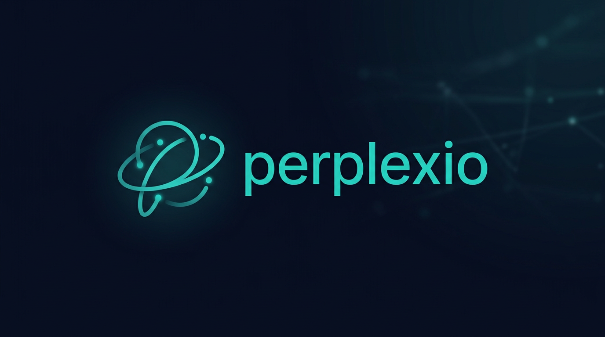

# Perplexio (SearxNG + OpenAI-compatible)



A minimal Perplexity-like backend you can run for free with:
- your own SearxNG instance for web search (self-hosted, no rate limits)
- any OpenAI-compatible LLM endpoint (`OPENAI_BASE_URL`)
- full runtime config via environment variables
- persistent storage under `/data` for uploads + chat history

## 1. Local run with Docker Compose

```bash
cp .env.example .env
docker compose up --build
```

Open: `http://localhost:8000`

## 1.5 Public Access Port

For public access, expose:
- `TCP 8000` to the app container (`perplexio`)

Do not expose:
- `UDP` (not used)

Recommended production setup:
- Expose `HTTPS 443` at your ingress/reverse proxy
- Proxy to internal app `TCP 8000`

## 2. Minimal Env Vars (Recommended)

You only need a small set of env vars to run the app.

```env
# Required for LLM
OPENAI_BASE_URL=https://integrate.api.nvidia.com/v1
OPENAI_MODEL=gpt-4o-mini
OPENAI_API_KEY=your-api-key

# Required for web search (your own SearxNG instance)
SEARXNG_BASE_URL=http://your-searxng-instance:8080

# Optional but recommended for personal deployment
AUTH_PASSWORD=change_me
DATA_DIR=/data
```

### SearxNG Setup

Deploy your own SearxNG instance for unlimited, rate-limit-free search:

```bash
docker run -d -p 8080:8080 searxng/searxng:latest
```

Then set `SEARXNG_BASE_URL` to your instance URL.

### Public SearxNG Instances (Fallback)

> **Warning:** Public instances rate-limit API requests. Self-hosted is recommended.

| Instance | URL |
|----------|-----|
| Sapti.me | `https://search.sapti.me` |
| Searx.be | `https://searx.be` |
| Ononoki | `https://search.ononoki.org` |
| Tiekoetter | `https://searx.tiekoetter.com` |

Notes:
- Embeddings default to the same endpoint as `OPENAI_BASE_URL`.
- If your embeddings endpoint is different, set:
  - `EMBEDDING_BASE_URL`
  - `EMBEDDING_MODEL`
  - `EMBEDDING_API_KEY`

Everything else can stay default and the app will still work.

## 2.5 Advanced Env Vars (Optional)

See `.env.example` for full tuning options:
- Search/retrieval: `SEARXNG_RESULT_COUNT`, `SEARCH_DEFAULT_MODE`, `SEARCH_MAX_HOPS`, `SEARCH_FOLLOWUP_QUERIES`
- Rerank/citations: `RERANK_*`, `CITATION_ALIGN_MIN_SCORE`, `SOURCE_QUALITY_MIN`, `CONFIDENCE_ABSTAIN_THRESHOLD`
- File retrieval: `FILE_*`, `MAX_FILE_CONTEXT_CHARS`
- OCR/transcription: `OCR_*`, `TRANSCRIPTION_*`, `WHISPER_CPP_*`
- Auth/session: `AUTH_COOKIE_NAME`, `AUTH_SESSION_MAX_AGE_SECONDS`, `AUTH_SESSION_SECRET`
- Ops: `BACKUP_RETENTION_COUNT`, `ASK_CACHE_*`

## 3. API

### Health
`GET /health`

### Ask
`POST /api/ask`

```json
{
  "query": "What happened in AI this week?",
  "top_k": 6,
  "thread_id": 12,
  "include_files": true,
  "file_ids": [1, 3, 9]
}
```

### Ask (streaming)
`POST /api/ask/stream`  
Server-Sent Events with:
- `event: meta` (citations)
- `event: token` (incremental text)
- `event: done` (`chat_id`, `thread_id`)
- `event: final` (aligned final answer, if adjusted)
- `event: error`

### Jobs
- `GET /api/jobs`
- `GET /api/jobs/{job_id}`

### Admin reindex uploaded files
`POST /api/admin/reindex`
```json
{
  "file_ids": [1, 2, 3],
  "limit": 100
}
```

### Admin reindex (async job)
`POST /api/admin/reindex/start`

### Admin purge chats + files
`POST /api/admin/purge`
```json
{
  "confirm": true
}
```

### Admin metrics
`GET /api/admin/metrics`

### Admin backup
`GET /api/admin/backup` (sqlite backup file)

### Persistent backups
- `GET /api/admin/backups`
- `POST /api/admin/backups/create`
- `GET /api/admin/backups/{name}/download`
- `POST /api/admin/backups/{name}/restore`

Response:
```json
{
  "answer": "...",
  "chat_id": 101,
  "thread_id": 12,
  "citations": [
    {"title":"...","url":"...","snippet":"..."}
  ]
}
```

### Upload file
`POST /api/files/upload` (multipart form field name: `file`)

### List uploaded files
`GET /api/files`

### Download uploaded file
`GET /api/files/{file_id}/download`

### List chat history
`GET /api/chats`

### Get one chat (with citations)
`GET /api/chats/{chat_id}`

### Get full thread
`GET /api/threads/{thread_id}`

### Get thread file attachments
`GET /api/threads/{thread_id}/files`

### Update thread file attachments
`PUT /api/threads/{thread_id}/files`
```json
{
  "file_ids": [1, 3, 9]
}
```

### Auth endpoints
- `GET /auth/me`
- `POST /auth/login`
- `POST /auth/logout`

## 4. Persistent Storage

The app stores runtime data in `DATA_DIR`:
- SQLite DB: `/data/perplexio.db`
- Uploads: `/data/uploads`

For Kubernetes, mount a persistent volume to `/data`.

Example pod spec fragment:
```yaml
containers:
  - name: perplexio
    image: ghcr.io/<owner>/<repo>:latest
    env:
      - name: DATA_DIR
        value: /data
    volumeMounts:
      - name: perplexio-data
        mountPath: /data
volumes:
  - name: perplexio-data
    persistentVolumeClaim:
      claimName: perplexio-pvc
```

## 5. File Type Support

Upload accepts any file type and stores it persistently.

Text extraction into LLM context currently supports:
- text files (`text/*`)
- PDF (`application/pdf`)
- images (`image/*`) via OCR when `OCR_ENABLED=1`
- audio/video (`audio/*`, `video/*`) via transcription when `TRANSCRIPTION_ENABLED=1`

## 6. Vector Retrieval For Uploaded Files

- On upload, extracted file text is chunked and embedded through your OpenAI-compatible embeddings endpoint.
- Embeddings are stored in SQLite (`file_chunks` table in `/data/perplexio.db`).
- During ask, the app embeds the query, ranks file chunks by cosine similarity, and sends top chunks to the LLM as file context.
- If embedding retrieval is unavailable, it falls back to plain file-context inclusion.

## 6.5 Web Retrieval Upgrades

- Query rewrite: app generates multiple search rewrites for broader coverage.
- Multi-search fusion: combines results from multiple rewritten queries with URL dedupe + fusion scoring.
- Iterative hops: optional follow-up query generation and second-hop retrieval.
- Reranker: embedding rerank with optional cross-encoder reranker.
- Citation alignment: final answer is post-processed to align claim-level citations.
- Trust/confidence guardrails: source quality thresholding + confidence scoring + low-confidence uncertainty notice.
- Advanced trust model includes: domain reputation heuristics, query-term relevance boost, recency boost, and domain diversity penalty.

## 7. OCR / Transcription Pipeline

- Image files (`image/*`): local OCR via `tesseract`.
- Audio files (`audio/*`): local transcription via `faster-whisper` (default), `whisper` CLI, or `whisper.cpp`.
- Video files (`video/*`): audio extracted with `ffmpeg`, then locally transcribed.
- Reindex endpoint can backfill text+embeddings for already uploaded files.
- Structured text extraction includes better handling for JSON/CSV/Markdown inputs.

Language configuration:
- OCR: `OCR_LANGUAGE=auto` (default behavior), single language (`eng`), or multi-language (`eng+ind` or `eng,ind`).
- Transcription: `TRANSCRIPTION_LANGUAGE=auto` for auto-detection, or set a specific language code (`en`, `id`, etc.).

## 7.5 Async Processing

- Upload indexing can run asynchronously (`/api/files/upload?async_index=true`), returning `job_id`.
- Reindex can run as background job (`/api/admin/reindex/start`).
- Poll job progress via `/api/jobs/{job_id}`.

Required binaries for full local pipeline:
- `tesseract` (for OCR)
- `ffmpeg` (for video/audio extraction)
- optional alternatives to built-in `faster-whisper`:
  - `whisper` CLI (OpenAI whisper python package CLI)
  - `whisper.cpp` binary + model file

## 8. Password Auth

- Set `AUTH_PASSWORD` to enable protection.
- UI prompts for password before API access.
- Session is cookie-based and persistent (`AUTH_SESSION_MAX_AGE_SECONDS`).
- With one deployed backend + shared `/data`, multiple devices see the same synced data after login.

## 8.5 UX Extras

- Follow-up suggestions: `GET /api/chats/{chat_id}/followups`
- Thread export: `GET /api/threads/{thread_id}/export?format=markdown|json`
- Richer source cards in UI: domain display + expandable snippets
- Citation markers in answers are clickable and jump to matching source cards.
- Jobs panel in UI for async indexing/reindex progress.
- Backups panel in UI for create/download/restore flows.
- PWA install support (`/manifest.webmanifest`, `/sw.js`) for Android "Add to Home screen".
- Mobile layout tuned for phone screens (chat/composer first, controls below).

## 9.5 Evaluation Harness

- Cases file: `eval/cases.json`
- Runner: `scripts/eval_harness.py`

Example:
```bash
python scripts/eval_harness.py --base-url http://localhost:8000 --password "<your_auth_password>"
```

Output:
- JSON report at `eval/report.json`
- process exit code `0` if all cases pass, `1` if any case fails

## 9. Build image locally

```bash
docker build -t perplexio:local .
docker run --rm -p 8000:8000 --env-file .env -v ./data:/data perplexio:local
```

## 10. Build + push GHCR from GitHub Actions

Workflow file: `.github/workflows/ghcr.yml`

It publishes to:
- `ghcr.io/<owner>/<repo>:latest`
- branch/tag/sha tags
- multi-arch image manifests for `linux/amd64` and `linux/arm64`

Requirements:
1. Push this repo to GitHub.
2. Ensure Actions are enabled.
3. On push to `main`/tags (or manually via `workflow_dispatch`), image is pushed using `GITHUB_TOKEN`.

Pull example:
```bash
docker pull ghcr.io/<owner>/<repo>:latest
```
